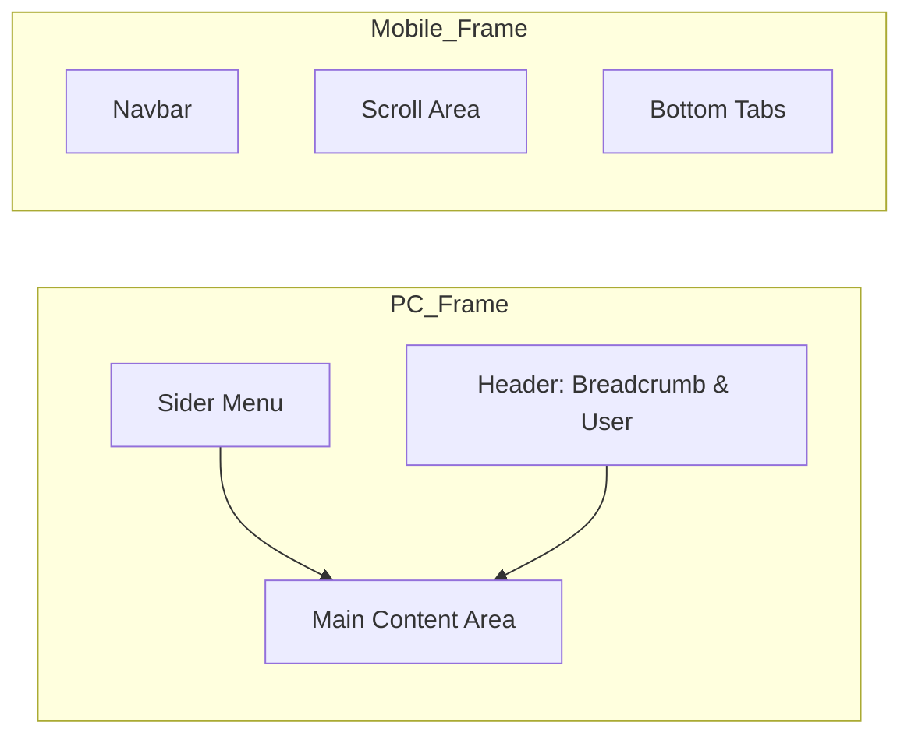

# 主界面框架 UI 设计方案

## 1. 框架结构设计

### 1.1. PC 端布局 (Side Navigation)
- **侧边栏 (Sider):** 
  - 顶部: 缩小版 Logo。
  - 中部: 垂直菜单，支持多级折叠。
  - 底部: 收起/展开切换按钮。
- **顶部栏 (Header):**
  - 左侧: 面包屑导航 (Breadcrumb)。
  - 右侧: 搜索、通知、全屏切换、用户信息 (头像+昵称+下拉菜单)。
- **内容区 (Content):**
  - 采用多页签 (Tabs) 模式或 单页面模式。
  - 模块以卡片 (Card) 形式承载，背景色为白色，四周留白。

### 1.2. 移动端布局 (Bottom Navigation)
- **顶部栏 (Navbar):** 
  - 左侧: 侧边抽屉菜单按钮 (用于访问更多模块)。
  - 中间: 当前模块标题。
  - 右侧: 个人中心入口。
- **内容区:** 纵向滚动，全屏展示模块内容。
- **底部栏 (Tabbar):** 
  - 放置 4-5 个核心常用模块入口 (如：首页、消息、订单、我的)。

## 2. 模块扩展机制
- **动态注入:** 框架监听路由变化，根据菜单配置动态加载对应的组件。
- **独立窗口:** 每个模块在内容区拥有独立的容器，互不干扰。
- **统一通信:** 模块通过全局 Store (Zustand) 或 Event Bus 与框架通信。

## 3. 视觉草图 (Mermaid)

