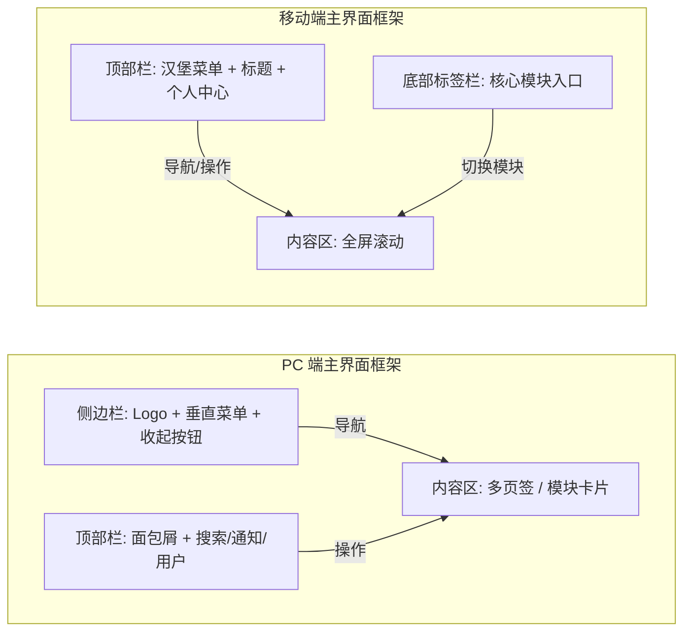

# 跨平台基础框架 - 前端 UI 设计方案

**版本：** 1.0
**日期：** 2026年1月13日
**作者：** Manus AI

## 1. 引言

本设计方案旨在为跨平台基础框架提供一套统一、灵活且易于扩展的前端用户界面（UI）设计指导。考虑到项目需适配PC、Mac、移动端和Web端，本方案将重点关注响应式设计、模块化布局以及用户体验的一致性。通过明确视觉规范、交互原则和不同设备的布局策略，确保框架能够高效支持未来业务功能的快速开发和迭代。

## 2. UI设计规范与交互原则

### 2.1. 视觉规范 (Visual Specs)

为保证产品在不同平台上的视觉统一性和品牌识别度，我们制定了以下视觉规范：

#### 2.1.1. 色彩系统

色彩是用户感知产品的第一要素，合理的色彩搭配能够提升用户体验和界面美感。本框架将采用一套基于科技蓝的主色调，并辅以成功、警告、错误和中性色，以满足不同场景的需求。

| 类型 | 色值 | 用途说明 |
|---|---|---|
| **主色 (Primary)** | `#1890ff` (科技蓝) | 用于主按钮、激活状态、关键链接和品牌元素，传达科技感和专业性。 |
| **成功色 (Success)** | `#52c41a` | 用于成功提示、操作完成状态或积极反馈，如表单提交成功。 |
| **警告色 (Warning)** | `#faad14` | 用于警告提示、待处理状态或需要用户注意的信息，如即将过期的通知。 |
| **错误色 (Error)** | `#f5222d` | 用于错误提示、危险操作或负面反馈，如表单校验失败、删除确认。 |
| **中性色 (Neutral)** | `#262626` (标题)<br>`#595959` (正文)<br>`#8c8c8c` (辅助)<br>`#d9d9d9` (边框)<br>`#f0f2f5` (背景) | 用于文本、背景、边框等非强调性元素，构建清晰的层级和舒适的阅读体验。 |

#### 2.1.2. 字体系统

字体选择和字号规范对于信息传达的清晰度和可读性至关重要。我们将采用一套跨平台兼容的字体方案。

*   **中文字体：** `PingFang SC`, `Microsoft YaHei`, `sans-serif`。确保在中文环境下有良好的显示效果。
*   **英文字体：** `-apple-system`, `BlinkMacSystemFont`, `'Segoe UI'`, `Roboto`, `'Helvetica Neue'`, `Arial`。优先使用系统默认字体，保证原生体验。
*   **字号规范：**
    *   **标题 1：** `24px` (Bold) - 用于页面主标题。
    *   **标题 2：** `20px` (Bold) - 用于模块标题或重要信息。
    *   **标题 3：** `16px` (Medium) - 用于次级标题或强调文本。
    *   **正文：** `14px` - 用于大部分内容文本，保证良好阅读体验。
    *   **辅助：** `12px` - 用于辅助信息、版权声明等。

#### 2.1.3. 间距与圆角

统一的间距和圆角规范有助于建立视觉秩序和界面亲和力。

*   **基础间距：** 以 `8px` 为基准单位，形成 `4px`, `8px`, `16px`, `24px`, `32px` 等系列间距，用于元素、组件和布局之间的间隔。
*   **圆角：**
    *   `4px` (基础) - 用于按钮、输入框等小尺寸组件。
    *   `8px` (卡片) - 用于信息卡片、面板等中等尺寸容器。
    *   `50%` (圆形) - 用于头像、圆形按钮等。

### 2.2. 交互原则 (Interaction Principles)

良好的交互设计能够提升用户操作效率和满意度。

#### 2.2.1. 响应式策略

为实现“一次开发，多端适配”，我们将采用“移动优先”的设计理念，并结合媒体查询和弹性布局。

*   **断点设计：**
    *   **Mobile：** 屏幕宽度小于 `576px`。
    *   **Tablet：** 屏幕宽度介于 `576px` 到 `992px` 之间。
    *   **Desktop：** 屏幕宽度大于 `992px`。
*   **布局转换：**
    *   **PC 端：** 采用经典的“侧边栏导航 + 顶部面包屑 + 内容区”布局，充分利用大屏幕空间。
    *   **移动端：** 采用“底部标签栏 (Tabbar)”或“顶部汉堡菜单 + 全屏内容区”的布局，适应小屏幕操作习惯。

#### 2.2.2. 模块化扩展原则

为方便功能模块的灵活扩展，框架将采用插槽式设计和动态加载机制。

*   **插槽式设计：** 界面框架提供标准的 `Header`、`Sider`、`Content`、`Footer` 等区域插槽，业务模块只需关注 `Content` 区域的开发。
*   **动态菜单：** 菜单项由后端配置动态生成，支持图标、标题和路由信息，方便管理员灵活配置功能入口。
*   **窗口化展示：** 点击菜单后，对应的功能模块将在主内容区的 Tab 页或独立的容器中展示，支持多任务并行操作。

#### 2.2.3. 反馈机制

及时有效的反馈是提升用户体验的关键。

*   **加载状态：** 对于耗时操作，提供全局 Loading 动画或局部 Skeleton Screen（骨架屏）来缓解用户等待焦虑。
*   **操作反馈：** 采用 Toast（移动端）或 Message（PC 端）组件，以非侵入式的方式向用户提供操作结果提示。
*   **空状态：** 统一的 Empty 组件，在数据为空时提供友好的提示和引导。

## 3. 登录页面 UI 设计方案

登录页面是用户与系统交互的第一步，其设计应简洁、直观且安全。

### 3.1. PC 端布局 (Desktop)

PC 端的登录页面将采用居中卡片式布局，背景简洁，突出登录表单。

*   **背景：** 采用浅灰色渐变或简约的几何图形背景，营造专业氛围。
*   **登录卡片：** 居中显示，固定宽度 `400px`，高度自适应内容，带有阴影效果，提升视觉焦点。
    *   **顶部：** 居中放置项目 Logo 和项目名称，明确品牌。
    *   **中部：**
        *   **Tab 切换：** 提供“账号登录”和“验证码登录”两种方式的 Tab 切换，方便用户选择。
        *   **输入框：** 带有前置图标（如用户图标、锁图标、手机图标），提升输入项的识别度，并支持实时格式校验。
        *   **辅助操作：** 包含“记住我”勾选框和“忘记密码”链接，方便用户管理账户。
    *   **底部：**
        *   **主按钮：** “登录”按钮采用主色调，醒目且易于点击，点击后显示加载状态。
        *   **第三方登录：** 提供微信、QQ、GitHub 等第三方登录图标按钮，方便用户快速登录。
        *   **注册入口：** “还没有账号？立即注册”链接，引导新用户注册。

### 3.2. 移动端布局 (Mobile)

移动端登录页面将采用全屏流式布局，适应小屏幕操作，强调简洁和易用性。

*   **背景：** 纯白背景，保持界面清爽，减少视觉干扰。
*   **布局：** 全屏流式布局，所有元素根据屏幕宽度自适应。
    *   **顶部：** 占据约 `30%` 屏幕高度的 Logo 展示区，居中显示项目 Logo 和名称。
    *   **中部：** 登录表单区域，左右留有 `24px` 的间距，确保内容不贴边，输入框和按钮宽度自适应。
    *   **底部：** 固定在底部的第三方登录区域，方便用户快速选择第三方登录方式。

### 3.3. 交互流程

1.  **用户输入信息：** 用户在输入框中输入账号、密码或手机号等信息时，系统进行实时格式校验，并给予提示。
2.  **点击登录：** 用户点击“登录”按钮后，按钮进入 Loading 状态，防止重复提交。
3.  **登录成功：** 登录成功后，页面通过渐隐动画平滑切换至主界面。
4.  **登录失败：** 登录失败时，页面顶部弹出错误提示信息，告知用户失败原因。

### 3.4. 视觉草图 (Mermaid)

```mermaid
graph TD
    subgraph PC_Login_Page[PC 端登录页面]
        direction TB
        PC_Background[背景: 浅灰色渐变]
        PC_Card[登录卡片: 居中, 400px 宽]
        PC_Card --> PC_Logo[Logo & 项目名称]
        PC_Card --> PC_Tabs[Tab 切换: 账号登录 / 验证码登录]
        PC_Card --> PC_Inputs[输入框: 账号, 密码/验证码]
        PC_Card --> PC_Actions[记住我 | 忘记密码]
        PC_Card --> PC_LoginBtn[登录按钮]
        PC_Card --> PC_ThirdParty[第三方登录图标]
        PC_Card --> PC_Register[立即注册]
    end

    subgraph Mobile_Login_Page[移动端登录页面]
        direction TB
        Mobile_Background[背景: 纯白]
        Mobile_LogoArea[顶部 Logo 区 (30% 高度)]
        Mobile_Form[登录表单区 (左右 24px 间距)]
        Mobile_ThirdPartyArea[底部第三方登录区]
    end
```

## 4. 主界面框架 UI 设计方案

主界面框架是用户进行业务操作的核心区域，其设计应支持模块化扩展，并提供良好的导航和信息展示能力。

### 4.1. PC 端布局 (Side Navigation)

PC 端采用经典的侧边栏导航布局，方便用户快速切换功能模块，并提供清晰的层级结构。

*   **侧边栏 (Sider)：**
    *   **顶部：** 放置缩小版项目 Logo，点击可返回首页。
    *   **中部：** 垂直菜单，支持多级折叠和展开，菜单项可配置图标和标题，点击后在内容区加载对应模块。
    *   **底部：** 提供收起/展开侧边栏的切换按钮，方便用户调整工作区大小。
*   **顶部栏 (Header)：**
    *   **左侧：** 显示当前页面的面包屑导航 (Breadcrumb)，帮助用户了解当前位置。
    *   **右侧：** 包含搜索功能、通知中心入口、全屏切换按钮和用户信息区域（用户头像、昵称及下拉菜单，提供个人中心、设置、退出登录等选项）。
*   **内容区 (Content)：**
    *   采用多页签 (Tabs) 模式，每个页签对应一个打开的功能模块，方便用户在不同模块间切换。
    *   模块内容以卡片 (Card) 形式承载，背景色为白色，四周留有 `16px` 或 `24px` 的间距，保持界面整洁。

### 4.2. 移动端布局 (Bottom Navigation)

移动端采用底部标签栏导航，适应移动设备的操作习惯，同时提供侧边抽屉菜单以容纳更多功能。

*   **顶部栏 (Navbar)：**
    *   **左侧：** 提供一个汉堡菜单按钮，点击后弹出侧边抽屉菜单，用于访问非底部标签栏中的功能模块。
    *   **中间：** 显示当前模块的标题。
    *   **右侧：** 提供个人中心或常用功能的入口。
*   **内容区：** 全屏展示当前模块的内容，支持纵向滚动。模块内容布局应简洁，避免过多层级。
*   **底部栏 (Tabbar)：**
    *   固定在屏幕底部，放置 `4-5` 个最核心、最常用的功能模块入口（如：首页、消息、订单、我的），每个入口包含图标和文字。

### 4.3. 模块扩展机制

为确保框架的灵活性和可扩展性，功能模块的加载和管理将遵循以下机制：

*   **动态注入：** 框架将监听路由变化，并根据预先配置的菜单信息，按需动态加载对应的功能模块组件。这有助于优化应用启动速度和资源占用。
*   **独立窗口：** 每个功能模块在主内容区都拥有独立的容器或 Tab 页，确保模块之间互不干扰，便于独立开发、测试和部署。
*   **统一通信：** 模块之间以及模块与框架之间，将通过全局状态管理库（如 Zustand）或轻量级的事件总线机制进行通信，实现低耦合的交互。

### 4.4. 视觉草图 (Mermaid)



## 5. 总结

本前端 UI 设计方案为跨平台基础框架提供了从视觉规范到具体页面布局的全面指导。通过遵循响应式设计原则、采用模块化架构和统一的交互反馈机制，旨在构建一个既能适应多端设备，又方便功能模块灵活扩展的现代化用户界面。此方案将作为前端开发团队实现 UI 的重要依据，确保产品在不同平台上的用户体验一致性和开发效率。
